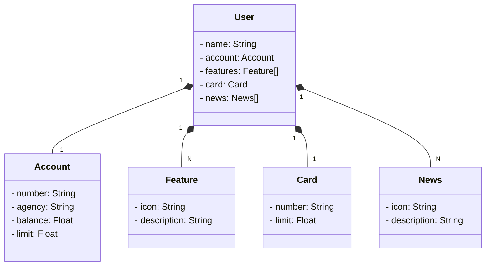

# Java API - Banking Homepage
Projeto baseado em [Santander Dev Week 2023 Java API](https://github.com/digitalinnovationone/santander-dev-week-2023-api)

RESTful API construída em Java 17 com Spring Boot 3.

## Principais Tecnologias

   - Java 17
   - Spring Boot 3
   - Spring Data JPA
   - OpenAPI (Swagger)
   - Railway

## Diagrama de Classes

